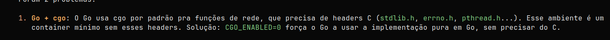
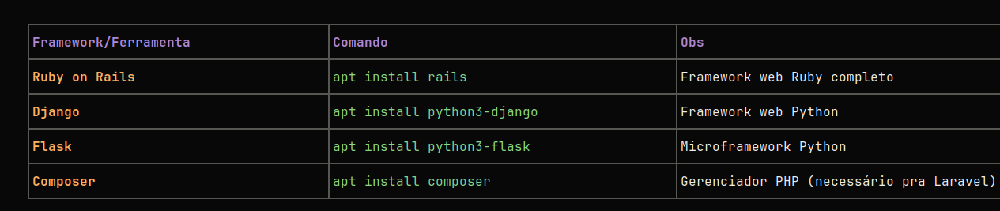

nao sei se é problema ou seguranca, mas eu nao to conseguindo copiar um texto do opencode dentro do ssh e colocarn o pc

definir o clang no lugar do gcc na instalacao, clang serve para o 2.

proximas linguangens, ruby, rust, java e zig

depois 
R, kotlin

talvez no futuro, bun e C#

sqlite
postgres
redis?
